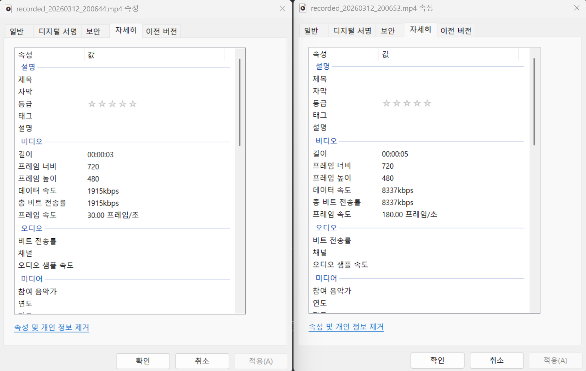

# FG Video Recorder

RTSP 스트림 또는 웹캠 영상을 실시간으로 시청하고, 프레임 보간과 함께 녹화할 수 있는 OpenCV 기반 영상 녹화 도구입니다.

## 기능

- **실시간 스트림 재생** — RTSP URL 또는 웹캠(로컬 장치) 입력 지원
- **녹화** — Space 키로 녹화 시작/중지, `output/` 폴더에 타임스탬프 파일명으로 저장
- **프레임 보간** — 녹화 시 프레임 사이에 보간 프레임을 삽입하여 부드러운 영상 생성 (단순 선형 보간)
  - `1`: 보간 OFF (원본 30fps)
  - `2` ~ `6`: n배 보간 (60fps ~ 180fps)
- **REC 표시** — 녹화 중 화면 우상단에 빨간 원과 REC 텍스트 오버레이

## 요구사항

```bash
pip install opencv-python opencv-contrib-python
```

## 사용법

```bash
# 웹캠 사용 (인수 없음)
python3 main.py

# RTSP 스트림 사용
python3 main.py rtsp://your.stream.url/live/channel.stream

# 로컬 영상 파일 사용
python3 main.py video.mp4
```

### 키 조작

| 키 | 동작 |
|---|---|
| `Space` | 녹화 시작 / 중지 |
| `1` | 프레임 보간 OFF |
| `2` ~ `6` | n배 프레임 보간 ON |
| `ESC` | 프로그램 종료 |

## 출력

녹화된 파일은 `output/` 폴더에 MP4 형식으로 저장됩니다.

```
output/recorded_20260312_153045.mp4
```

## 시연


기본적인 녹화 능력을 점검하고, 프레임 보간을 킨 상태로 녹화를 테스트하는 영상입니다.



녹화된 영상의 프레임을 비교한 스크린샷입니다. 두 영상의 프레임레이트 차이를 직접 보여드릴 수 없어 설명으로 대체하자면, 선형 보간으로 프레임을 생성한만큼 고스팅 현상이 존재하지만, 영상을 느리게 재생했을 때 확실히 영상이 부드럽게 재생되는 것을 확인할 수 있었습니다.